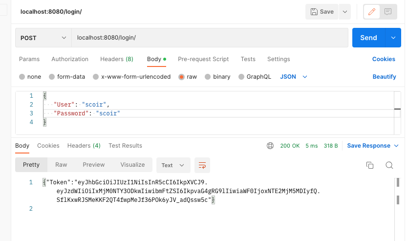
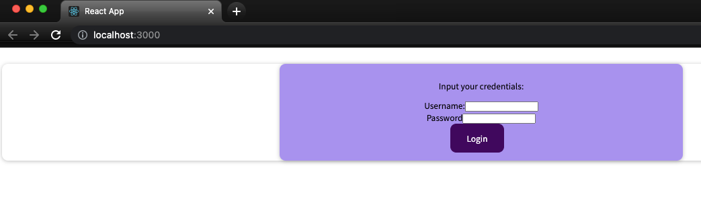
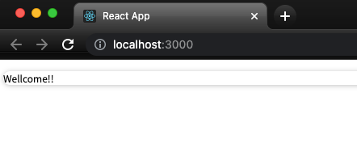
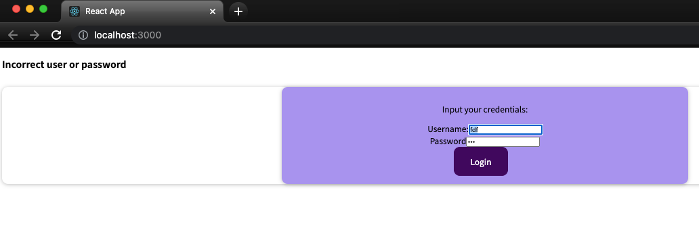

# Dependencies
This is the environment used for development, other version has not been tested, but probably will work

* npm 8.11.0
* go  1.19.4

# How-To
## Back End

Execute main.go on the directory back end

``` shell
go run main.go
```

## Front end
Navigate to the dir ´front-enf´, execute 

``` shell
npn install
npm start
```
that should start a development server locally

## Usage
To test the api, any http client can be used, in this case we use postman:



To use the UI, navigate to : localhost:3000



Credentials are : scoir/scoir , in case of correct and incorrect input, you'll see this screens acordingly





# Assumptions

* The login service, returns a mock JWT Token as it's a common and probed secure authentication method, this can be saved on the local storage and expired as the security requirements/needs
* For simplicity, user credentials are hardcoded in the code, a secure store shall be used.
* Front end shall have it's on test, has been omitted due time constraint
* Secure protocols shall be in place (https and corresponding certificates) and cors shall not be active, This has been omitted as they belong to infrastructure layer
* Log service hasn't been included, but it's considered imperative, for example the adoption of a logging infrastructure such as *Datadog* or *CloudWatch*

# Test
To execute back end test :

```shell
➜  back-end git:(main) ✗ go test ./...
ok      github.com/ponsonio/scoir-jcabrera-challenge/back-end   0.456s
ok      github.com/ponsonio/scoir-jcabrera-challenge/back-end/auth      0.279s
?       github.com/ponsonio/scoir-jcabrera-challenge/back-end/server    [no test files]
```

Test are in place to present the approach on how to cover layer of components. Integration tests has not being included due time/infrastructure reasons. Still is wort mention that can be
fairly easy to implemented using for example docker locally or a docker based environment on CI.

Front end test has been not included due time reasons, and they don't seem necessary to show the approach taken, although they can be implemented using for example
Jest or any other React testing library.